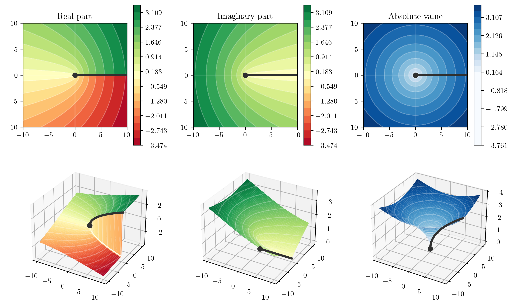
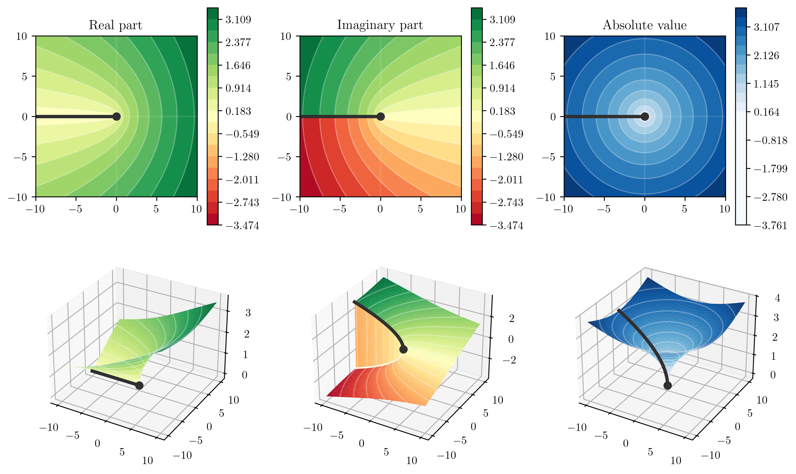

Complex analysis
================

Complex field
-------------

Consider the group :math:`\mathbb{R}^2 \equiv \mathbb{R} \times \mathbb{R}` which is a set of 2-dimensional vectors, closed under a binary operation we call "addition" (:math:`+`),

.. math::
    \mathrm{add} : \mathbb{R}^2 \times \mathbb{R}^2 &\rightarrow \mathbb{R}^2 , \\
	((a_1, a_2), (b_1, b_2)) &\mapsto (a_1, a_2) + (b_1, b_2) = (a_1 + b_1, a_2 + b_2) \, .
    :label: eq:complex-addition

One can define another binary operator called "multiplication",

.. math::
    \mathrm{mult} : \mathbb{R}^2 \times \mathbb{R}^2 &\rightarrow \mathbb{R}^2 , \\
	((a_1, a_2), (b_1, b_2)) &\mapsto (a_1, a_2)(b_1, b_2) = (a_1 b_1 - a_2 b_2, a_1 b_2 + a_2 b_1) \, .
    :label: eq:complex-multiplication

We can check that these two binary operations satisfy the field axioms. We call the resulting field the *complex field* :math:`\mathbb{C}`. It is common to denote the basis elements by

.. math::
    (1, 0) \equiv 1,
	\qquad
	(0, 1) \equiv i,

where the corresponding components are called the "real" and "imaginary" parts of a *complex number*. With this, one can write for :math:`z\in\mathbb{C}`,

.. math::
    z = \mathrm{Re}(z) + i \, \mathrm{Im}(z).

The multiplication operator defined via Eq. :eq:`eq:complex-multiplication` has two important features:

1. The subfield :math:`\{z \in \mathbb{C} \,|\, z = (z_1, 0)\}` forms the real field :math:`\mathbb{R}` under the usual multiplication of numbers.
2. :math:`i^2 = -1`, which provides a solution to a polynomial equation, :math:`x^2 + 1 = 0`.

This hints at the fact that the complex field :math:`\mathbb{C}` is an algebraic closure of :math:`\mathbb{R}` [A field :math:`F` is algebraically closed if every non-constant polynomial with coefficients in :math:`F` also has a solution in :math:`F`. The polynomial :math:`x^2+1` can be used as a counter-example to show that :math:`\mathbb{R}` is *not* algebraically closed. One can prove, on the other hand, that :math:`\mathbb{C}` *is* (see e.g. ).]. The additional dimension along :math:`i = (0,1)` is called the "imaginary axis" due to historic reasons. An important unary operation called "complex conjugation" (:math:`{}^*`) is defined to invert the imaginary component of a complex number,

.. math::
    \mathrm{conj} : \mathbb{C} &\rightarrow \mathbb{C} , \\
	(z_1, z_2) &\mapsto (z_1, z_2)^* = (z_1, -z_2) \, .
    :label: eq:complex-conjugation

Complex numbers are commonly represented using polar coordinates :math:`r\in[0,\infty)` and :math:`\theta\in[0,2\pi)`,

.. math::
    z = r e^{i\theta} = r \cos(\theta) + i \, r \sin(\theta) \, .
    :label: eq:complex-polar-representation

One can check, that

.. math::
    r^2 &= \left(\mathrm{Re}(z)\right)^2 + \left(\mathrm{Im}(z)\right)^2 = z z^* \equiv |z|^2 \, , \\
	\theta &= \tan^{-1}(\mathrm{Im}(z) / \mathrm{Re}(z)) \equiv \mathrm{arg}(z) \, .

Functions and analyticity
-------------------------

Consider a function :math:`f(z)` defined on a domain :math:`z \in \mathcal{D}`. We call this function *differentiable* at a point :math:`z_0` if the limit

.. math::
    \lim_{z \to z_0} \frac{f(z) - f(z_0)}{z - z_0} \equiv f'(z_0)

exists. If :math:`f` is differentiable at each point of :math:`\mathcal{D}`, we call it *analytic* in :math:`\mathcal{D}`. The limit should exist irrespective of how :math:`z` approaches :math:`z_0`, which leads to the Cauchy--Riemann conditions: if :math:`f \equiv u + i v` is analytic in :math:`\mathcal{D}`, then throughout :math:`\mathcal{D}` it satisfies [The proof is very simple and can be found in many textbooks on complex analysis, e.g. :cite:`FischerComplexVariables`.]

.. math::
    \frac{\partial u}{\partial x} = \frac{\partial v}{\partial y},
	\quad
	\frac{\partial u}{\partial y} = -\frac{\partial v}{\partial x}.

Poles and the residue theorem
-----------------------------

A very important result for analytic functions is the Cauchy's theorem, which states that for an analytic function :math:`f` in :math:`\mathcal{D}` and a piecewise smooth closed curve :math:`\mathcal{C}` in :math:`\mathcal{D}` we have

.. math::
    \oint_{\mathcal{C}} f(z) \text{d} z = 0 \, .
    :label: eq:Cauchy-theorem

If :math:`f` contains isolated singularities :math:`\{z_1, z_2, \dots, z_n\}`, the residue theorem states

.. math::
    \oint_{\mathcal{C}} f(z) \text{d} z = 2\pi i \sum_{z_k \text{ inside } \mathcal{C}} \mathrm{Res}(f; z_k) \, ,
    :label: eq:residue-theorem

where :math:`\mathrm{Res}(f; z_k)` is called the *residue* of :math:`f` at point :math:`z_k` and can be computed for simple poles via

.. math::
    \mathrm{Res}(f; z_k) = \lim_{z \to z_k} (z - z_k) f(z) \, .
    :label: eq:residiue-def

This leads to the Cauchy's integral formula. Suppose :math:`f` is analytic in :math:`\mathcal{D}`. Then, for a piecewise smooth, positively oriented simple closed curve :math:`\mathcal{C}` whose inside :math:`\mathcal{D}_{\mathcal{C}}` also lies in :math:`\mathcal{D}`, one has

.. math::
    f(z) = \frac{1}{2\pi i} \oint_{\mathcal{C}} \frac{f(w) \text{d} w}{w-z} \, ,
	\qquad
	\text{for all } z \in \mathcal{D}_{\mathcal{C}}.
    :label: eq:Cauchy-integral-formula

This formula will be exploited heavily in the section about dispersion relations.

Roots, logarithms, and branch cuts
----------------------------------

The square root of a number :math:`x` is introduced to solve the equation of type

.. math::
    y^2 = x.

Due to the surjective nature of the square, there is a sign ambiguity in defining the square root,

.. math::
    \sqrt{x}^{I} = y, \quad \text{or} \quad \sqrt{x}^{II} = -y,

where we conventionally choose :math:`\sqrt{x}\equiv\sqrt{x}^{I}`. This ambiguity has a special importance in the context of complex numbers and is connected with a concept called Riemann sheets. To see this connection, consider taking a square root of Eq. :eq:`eq:complex-polar-representation`,

.. math::
    \sqrt{z} = \sqrt{r e^{i\theta}} = \sqrt{r} e^{i\theta/2} .

This makes it clear that :math:`\sqrt{z}` has no limit at :math:`\theta=0`,

.. math::
    \lim_{\theta \rightarrow 0^+} \sqrt{r e^{i\theta}} = \sqrt{r} \neq \sqrt{r} e^{i\pi} = \lim_{\theta \rightarrow 2\pi^-} \sqrt{r e^{i\theta}} \, .

.. _fig:sqrtRHC:

    
    Complex plot of :math:`\sqrt{z}` on the first Riemann sheet.

In complex analysis this type of discontinuity is referred to as a branch cut and is illustrated on :numref:`fig:sqrtRHC`. Noting that :math:`e^{i\pi} = -1`, one can recognize

.. math::
    \lim_{\theta \rightarrow 0^+} \sqrt{r e^{i\theta}} &= \sqrt{r}^{I} , \\
	\lim_{\theta \rightarrow 2\pi^-} \sqrt{r e^{i\theta}} &= \sqrt{r}^{II} .

For a general case, one defines

.. math::
    \sqrt{z}^{I} &= \sqrt{|z|} e^{i \arg{z}/2} , \\
	\sqrt{z}^{II} &= \sqrt{|z|} e^{i (\arg{z}+2\pi)/2} = |z| e^{i \arg{z}/2} e^{i\pi}.

The superscripts :math:`I,II` enumerate the Riemann sheets for the square root. Note, that since :math:`e^{i (\arg{z}+4\pi)/2} = e^{i \arg{z}/2} e^{i2\pi} = e^{i \arg{z}/2}`, square root has only two sheets, which are smoothly connected along the branch cut. Correspondingly, :math:`n^{\text{th}}` roots have :math:`n` Riemann sheets,

.. math::
    \sqrt[n]{z}^{I} &= \sqrt[n]{|z|} e^{i \arg{z}/n} , \\
	\sqrt[n]{z}^{II} &= \sqrt[n]{|z|} e^{i (\arg{z}+2\pi)/n} , \\
	\sqrt[n]{z}^{III} &= \sqrt[n]{|z|} e^{i (\arg{z}+4\pi)/n} , \\
	&\vdots

.. _fig:sqrtnumpy:

    
    Complex plot of :math:`\sqrt{z}` on the first Riemann sheet, with a left-hand cut according to ``numpy`` conventions :cite:`harris2020array`. Note, that in contrast with the plots on :numref:`fig:sqrtRHC`, here the cut is placed in the imaginary part.

Another relevant example of a function with a branch cut is the logarithm,

.. math::
    \log(z) = \log(r e^{i\theta}) = \log(r) + i\theta .

Since :math:`\log` turns :math:`\theta` into imaginary part, it loses the cyclic property and we end up with infinite amount of Riemann sheets,

.. math::
    \log^{I}(z) &= \log(r) + i\theta , \\
	\log^{II}(z) &= \log(r) + i\theta + i2\pi , \\
	\log^{III}(z) &= \log(r) + i\theta + i4\pi , \\
	&\vdots

Finally, we note that the position of the branch cut depends on the convention. Many numeric packages define :math:`\theta \in (-\pi, \pi]`, which sets the branch cut on the left side of the complex plane, as depicted on :numref:`fig:sqrtnumpy`. Throughout this thesis, we refer to the special cases of branch cuts at :math:`\theta=0` and :math:`\theta=\pi` as right-hand cut (RHC) and left-hand cut (LHC), correspondingly.

