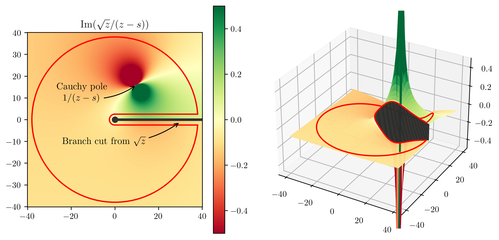

Dispersion relations
====================

Kramers--Kronig relations
-------------------------

In this section we take a closer look at Eq. :eq:`eq:Cauchy-integral-formula`. Since the Cauchy's integral formula assumes analyticity inside the integration curve, we need to choose the curve :math:`\mathcal{C}` in such a way that it

1. encloses the Cauchy pole,
2. excludes the non-analytic parts of :math:`f`.

For simplicity, consider a complex function :math:`f(z)` that is analytic on the entire :math:`\mathbb{C}` except for a single branch cut, spanning a subset of the real line. Then, :math:`\mathbb{C}` can be deformed as depicted in :numref:`fig:Cauchy-sqrt`. This results into three contributions to Eq. :eq:`eq:Cauchy-integral-formula`, namely,

.. math::
    f(s)
	= \frac{\lim_{\epsilon \to 0}}{2\pi i} \bigg(
		\underbrace{\int_{s_{\text{thr}}}^{R} \frac{f(z + i\epsilon) \text{d} z}{z-s}}_{\text{above the branch cut}}
		+ \underbrace{\int_{R}^{s_{\text{thr}}} \frac{f(z - i\epsilon) \text{d} z}{z-s}}_{\text{below the branch cut}}
		+ \underbrace{i \int_{0}^{2\pi} \frac{f(R e^{i\theta}) R e^{i\theta} \text{d} \theta}{R e^{i\theta}-s}}_{\text{arc}}
	\bigg) ,
    :label: eq:Cauchy-integral-formula-split

where :math:`s_{\text{thr}}` is the beginning of the branch cut (i.e. a "threshold") and :math:`R` is the radius of the arc. If :math:`f(R e^{i\theta})` drops for large values of :math:`R` (which is typically the case for physical amplitudes), the arc contribution can be neglected and in the limit of :math:`R \to \infty` we have

.. math::
    f(s)
	&= \frac{1}{2\pi i} \lim_{\epsilon \to 0} \bigg(
	\int_{s_{\text{thr}}}^{\infty} \frac{f(z + i\epsilon) \text{d} z}{z-s}
	+ \int_{\infty}^{s_{\text{thr}}} \frac{f(z - i\epsilon) \text{d} z}{z-s}
	\bigg) \\
	&= \frac{1}{2\pi i} \lim_{\epsilon \to 0}
	\int_{s_{\text{thr}}}^{\infty} \frac{\left(f(z + i\epsilon) - f(z - i\epsilon)\right) \text{d} z}{z-s} \, .
    :label: eq:Cauchy-integral-formula-cuts

.. _fig:Cauchy-sqrt:

    
    Integration contour (red curve) for the Cauchy's integral formula for :math:`f(z)=\sqrt{z}`.

The term in brackets :math:`\left(f(z + i\epsilon) - f(z - i\epsilon)\right)` is often denoted as :math:`\mathrm{Disc}(f(z))`. If a function :math:`f` is real on a finite segment of the real axis, the Schwarz reflection principle  states that for a domain :math:`\mathcal{D}` enclosing this finite segment, if :math:`f` is analytic in :math:`\mathcal{D}`,

.. math::
    f(z^*) = (f(z))^*
	\quad
	\text{for } z \in \mathcal{D} \, .

If this condition holds, we can rewrite

.. math::
    \mathrm{Disc}(f(z)) = \left(f(z + i\epsilon) - f(z + i\epsilon)^*\right)
	= 2i \, \mathrm{Im}(f(z)) \,

and therefore,

.. math::
    f(s) = \frac{1}{\pi} \int_{s_{\text{thr}}}^{\infty} \frac{\mathrm{Im}(f(z)) \text{d} z}{z-s} \, .
    :label: eq:kramers-kronig

If we take out the Cauchy pole contribution using the Sokhotski--Plemelj theorem ,

.. math::
    \lim_{\epsilon \to 0^+} \frac{1}{x \pm i\epsilon} = \mp i\pi\delta(x) + \mathcal{P}\!\left(\frac{1}{x}\right) \, ,
    :label: eq:sokhotski-plemelj

we arrive at

.. math::
    \mathrm{Re}(f(s)) = \frac{1}{\pi} \mathcal{P}\!\!\int_{s_{\text{thr}}}^{\infty} \frac{\mathrm{Im}(f(z)) \text{d} z}{z-s} \, ,
    :label: eq:kramers-kronig-re

where :math:`\mathcal{P}\!\!\int` denotes the Cauchy principal value integral. Both Eq. :eq:`eq:kramers-kronig` and Eq. :eq:`eq:kramers-kronig-re` are forms of the Kramers--Kronig relations  and demonstrate how a function :math:`f` can be reconstructed on :math:`z\in\mathcal{D}` using the knowledge of just the non-analytic parts as an input. If :math:`f` has poles in addition to the branch cut(s), one needs to add the corresponding residues to these relations.

Subtractions
------------

Eq. :eq:`eq:kramers-kronig` is often referred to as an unsubtracted dispersion relation and has a clear caveat: the convergence behaviour depends on the asymptotics of the branch cut. If :math:`\mathrm{Im}(f(z))` grows fast enough as :math:`z \to \infty`, the integral diverges. To cure this, we may exploit the fact that :math:`f` is analytic at :math:`f(s_0 < s_\text{thr})`. Define

.. math::
    g(s) = \frac{f(s) - f(s_0)}{s - s_0} \, .
    :label: eq:unsubtracted-f-redefinition

Since :math:`f` is analytic at :math:`s_0`, :math:`g` is regular there and, at the same time, drops faster than :math:`f` by one power in :math:`s`. Therefore, one can write an unsubtracted dispersion relation

.. math::
    g(s) = \frac{1}{\pi} \int_{s_{\text{thr}}}^{\infty} \frac{\mathrm{Im}(g(z)) \text{d} z}{z-s}

and using Eq. :eq:`eq:unsubtracted-f-redefinition` arrive at

.. math::
    f(s) = f(s_0) + \frac{s-s_0}{\pi} \int_{s_{\text{thr}}}^{\infty} \frac{\mathrm{Im}(f(z)) \text{d} z}{(z-s_0)(z-s)} \, .

We can repeat this procedure :math:`n` times to arrive at

.. math::
    f(s) = \sum_{k=0}^{n-1} \underbrace{\frac{f^{(k)}(s_0)}{k!}}_{f_k} (s-s_0)^{k} + \frac{(s-s_0)^n}{\pi} \int_{s_{\text{thr}}}^{\infty} \frac{\mathrm{Im}(f(z)) \text{d} z}{(z-s_0)^n(z-s)} \, .
    :label: eq:n-subtracted-dispersion-relation

Eq. :eq:`eq:n-subtracted-dispersion-relation` is called the nth subtracted dispersion relation and in contrast with Eq. :eq:`eq:kramers-kronig`, needs :math:`n` subtraction constants :math:`f_k` as part of the input.

Integrating over the Cauchy kernel
----------------------------------

Taking an integral with a Cauchy singularity can become numerically unstable. To solve this issue, one usually separates

.. math::
    \int_{s_{\text{thr}}}^{\infty} \frac{\mathrm{Im}(f(z)) \text{d} z}{(s-s_0)^n(s-z)}
	&= \int_{s_{\text{thr}}}^{\infty} \frac{\left(\mathrm{Im}(f(z))-\mathrm{Im}(f(s))\right) \text{d} z}{(z-s_0)^n(s-z)} \\
	&+ \mathrm{Im}(f(s)) \int_{s_{\text{thr}}}^{\infty} \frac{\mathrm{Im}(f(z)) \text{d} z}{(z-s_0)^n(z-s)} \, ,
    :label: eq:Cauchy-monomial-dispersion-integral

where the integral

.. math::
    \mathcal{I}_{-n}(s, s_0; s_\text{thr}, \infty) \equiv \int_{s_{\text{thr}}}^{\infty} \frac{\mathrm{Im}(f(z)) \text{d} z}{(z-s_0)^n(z-s)}

is independent of :math:`f` and can be computed analytically,

.. math::
    \mathcal{I}_{-n}(s, s_0; s_{\text{\text{thr}}}, \infty)
	= (s-s_0)^{-n} \left(
	\log\left(\frac{z-s}{z-s_0}\right)
	+ \sum_{k=1}^{n-1} \frac{1}{k} \frac{(s-s_0)^{k}}{(z-s_0)^{k}}
	\right)\bigg|_{z=s_{\text{\text{thr}}}}^{z=\infty} \, .

Given that :math:`\mathrm{Im}(f(z))` (i.e. the discontinuity itself) is differentiable along the cut, the first term of Eq. :eq:`eq:Cauchy-monomial-dispersion-integral` has a regular integrand at :math:`z=s` and one can take the integral without numerical complications. It is instructive to take explicit look at this for a once-subtracted case,

.. math::
    f(s)
	&= f(s_0)
	+ \frac{s-s_0}{\pi} \int_{s_{\text{thr}}}^{\infty} \frac{\left(\mathrm{Im}(f(z))-\mathrm{Im}(f(s))\right) \text{d} z}{(z-s_0)(z-s)}
	+ \frac{\mathrm{Im}(f(s))}{\pi} \log\left(\frac{s_{\text{thr}}-s_0}{s_{\text{thr}}-s}\right) \\
	&= \underbrace{f(s_0)
	+ \frac{s-s_0}{\pi} \int_{s_{\text{thr}}}^{\infty} \frac{\left(\mathrm{Im}(f(z))-\mathrm{Im}(f(s))\right) \text{d} z}{(z-s_0)(z-s)} + \frac{\mathrm{Im}(f(s))}{\pi} \log\left(\left|\frac{s_{\text{thr}}-s_0}{s_{\text{thr}}-s}\right|\right)}_{\text{real part}} \\
	&+ i \, \underbrace{\mathrm{Im}(f(s)) \, \theta(s-s_\text{thr})}_{\text{imaginary part}} \, ,
    :label: once-subtracted-dispersion-relation-explicit

where we have used

.. math::
    \log(-r) = \log(r e^{i\pi}) = \log(r) + i\pi \, .

Eq. :eq:`once-subtracted-dispersion-relation-explicit` shows how the dispersion integral reproduces the input :math:`\mathrm{Im}(f(s))` by definition.