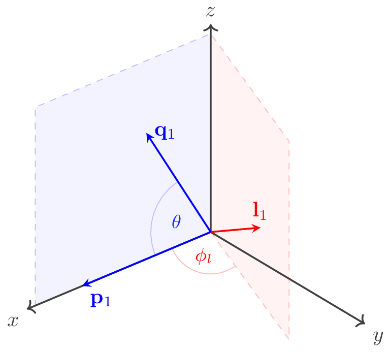

.. _dynamics-section:

Dynamics
========
S-matrix and unitarity
----------------------
Consider the process :math:`\ket{p_1 p_2, a}_\text{in} \rightarrow \ket{q_1 q_2, b}_\text{out}`. We define the scattering matrix :math:`\mathcal{S}` which maps the in-states to out-states. The matrix elements will be given by

.. math::
    _{\text{out}}\!\bra{q_1 q_2,b} \mathcal{S} \ket{p_1 p_2,a}_\text{in}
    =  (2\pi)^4\delta^4(p_1+p_2-q_1-q_2)\,\mathcal{S}_{ba}(q_1, q_2, p_1, p_2) \, .

We define the reaction amplitude :math:`\mathcal{M}` using

.. math::
    _{\text{out}}\!\bra{q_1 q_2,b} \mathcal{S} - 1 \ket{p_1 p_2,a}_\text{in}
    =  i(2\pi)^4\delta^4(p_1+p_2-q_1-q_2)\,\mathcal{M}_{ba}(q_1, q_2, p_1, p_2) \, .

Given

.. math::
    \braket{q_1 q_2, b | p_1 p_2, a}
    = (2\pi)^4 \delta^{(4)} (p_1 - q_1)
    (2\pi)^4 \delta^{(4)} (p_2 - q_2) \,
    \delta_{ba} \, ,
    :label: eq:overlap

we have

.. math::
    \mathcal{S}_{ba} (p_1, p_2, q_1, q_2) =
        (2\pi)^4 \delta^{(4)} (p_1 - q_1) \, \delta_{ba}
        + i \mathcal{M}_{ba}(q_1, q_2, p_1, p_2) \, .

We require :math:`\mathcal{S}` to be unitary, i.e. :math:`\mathcal{S}^\dagger \mathcal{S} = \mathcal{S} \mathcal{S}^\dagger = 1`. Written in terms of the matrix elements,

.. math::
    &\braket{q_1 q_2, b | p_1 p_2, a}
    = \bra{q_1 q_2,b} \mathcal{S}^\dagger \mathcal{S} \ket{p_1 p_2,a} \\
    &= \sum_c \int
    \frac{\text{d}^3 l_1}{(2\pi)^3 \, 2E_1}
    \frac{\text{d}^3 l_2}{(2\pi)^3 \, 2E_2}
    \bra{q_1 q_2,b} \mathcal{S}^\dagger
    \ket{l_1 l_2, c} \bra{l_1 l_2, c}
    \mathcal{S} \ket{p_1 p_2,a} \\
    &= (2\pi)^4 \delta^{(4)}(p_1 + p_2 - q_1 - q_2)
    (2\pi)^4 \sum_c \int \text{d} \Phi_2 \,
    \mathcal{S}^*_{cb}(l_1, l_2, q_1, q_2)
    \mathcal{S}_{ca}(l_1, l_2, p_1, p_2) \, ,

with :math:`\text{d}\Phi_2` being the two-particle phase space measure, as defined in Eq. :eq:`eq:n-body-phase-space`. Using Eq. :eq:`eq:overlap` and factoring out one of the :math:`\delta` functions, we get

.. math::
    (2\pi)^4 (p_1 - q_1) \, \delta_{ba}
    = (2\pi)^4 \sum_c \int \text{d} \Phi_2 \,
    \mathcal{S}^*_{cb}(l_1, l_2, q_1, q_2)
    \mathcal{S}_{ca}(l_1, l_2, p_1, p_2) \, .

Expressing this in terms of the :math:`\mathcal{M}` matrix elements,

.. math::
    &\mathcal{M}_{ba}(p_1, p_2, q_1, q_2)
    - \mathcal{M}_{ab}^*(q_1, q_2, p_1, p_2) \\
    &= i (2\pi)^4 \sum_c \int \text{d} \Phi_2 \,
    \mathcal{M}_{cb}^*(l_1, l_2, q_1, q_2)
    \mathcal{M}_{ca}(l_1, l_2, p_1, p_2) \, .

Since :math:`\mathcal{M}_{ab}` must be invariant under Lorentz transformations, one can (by slight abuse of notation) rewrite the above relation in terms of the Mandelstam variable :math:`s` and the scattering angles,

.. math::
    \mathcal{M}_{ba}(s,\cos\theta)
    - \mathcal{M}_{ab}^*(s,\cos\theta)
    = i (2\pi)^4 \sum_c \int \text{d} \Phi_2 \,
    \mathcal{M}_{cb}^*(s,\cos\theta_q)
    \mathcal{M}_{ca}(s,\cos\theta_p) \, ,

where

.. math::
    \theta = \angle (\vec{p}_1, \vec{q}_1),
    \quad
    \theta_q = \angle (\vec{l}_1, \vec{q}_1),
    \quad
    \theta_p = \angle (\vec{l}_1, \vec{p}_1).

Using Eq. :eq:`eq:two-body-phase-space-integral`, we obtain the discontinuity relation for :math:`\mathcal{M}`,

.. math::
    &\mathrm{Disc}(\mathcal{M}_{ba}(s,\cos\theta))
    \equiv
    \mathcal{M}_{ba}(s,\cos\theta)
    - \mathcal{M}_{ab}^*(s,\cos\theta) \\
    &= i \sum_c \rho_c(s)
    \int_{0}^{2\pi} \frac{\text{d}\phi_l}{2\pi}
    \int_{-1}^{+1} \text{d} \cos\theta_q \,
    \mathcal{M}_{cb}^*(s,\cos\theta_q)
    \mathcal{M}_{ca}(s,\cos\theta_p) \, .
    :label: eq:M-disc-relation

Note, that while the amplitudes :math:`\mathcal{M}_{ca/cb}` do not explicitly depend on the azimuthal angles, the cosines of :math:`\theta_q` and :math:`\theta_p` depend on the azimuthal angle :math:`\phi_l` of :math:`\vec{l}_1` (see :numref:`fig:intermediate-angles`),

.. math::
    \cos(\theta_q) = \cos(\theta)\cos(\theta_q)
	+ \sin(\theta)\sin(\theta_q) \cos(\phi_l) \, , \\
	\cos(\theta_p) = \cos(\theta)\cos(\theta_p)
	+ \sin(\theta)\sin(\theta_p) \cos(\phi_l) \, .
    :label: eq:azimuthal-to-polar

.. _fig:intermediate-angles:

    
    Spatial configuration of :math:`\vec{p}_1`, :math:`\vec{q}_1`, and :math:`\vec{l}_1`. One can always rotate the coordinate system so that :math:`\vec{p}_1` and :math:`\vec{q}_1` fall onto e.g. the :math:`xz`-plane. However, with a third momentum :math:`\vec{l}_1`, the case is necessarily 3-dimensional and we need to consider the azimuthal angle :math:`\phi_l` (see Eq. :eq:`eq:azimuthal-to-polar` and the surrounding text for more details).

Partial wave expansion
----------------------

Physical amplitudes are often decomposed in states of definite angular momentum. This is done by the so-called partial wave expansion,

.. math::
    \mathcal{M}(s, \cos\theta) = 
	\sum_{\ell=0}^{\infty} (2\ell+1) M_\ell(s) P_\ell(\cos\theta) \, ,
    :label: eq:partial-wave-expansion

where :math:`M_\ell` are called the *partial waves* and :math:`P_\ell` denote the Legendre polynomials, given by

.. math::
    P_\ell(x) = \frac{1}{2^\ell \ell!} \frac{\text{d}^\ell}{\text{d} x^\ell} (x^2 - 1)^\ell \, .

They satisfy the orthogonality relations

.. math::
    &\int_{-1}^{+1} \text{d} x P_\ell(x) P_{\ell'}(x)
	= \frac{2}{2\ell+1} \delta_{\ell \ell'} \, , \\
	&\sum_{\ell=0}^{\infty} P_\ell(x) P_\ell(y)
	= \frac{2}{2\ell+1} \delta(x - y) \, .

With this, one can invert Eq. :eq:`eq:partial-wave-expansion` to project the full amplitude on a specific partial wave,

.. math::
    M_\ell(s) = \frac{1}{2} \int_{-1}^{+1} \text{d} \cos\theta \,
	\mathcal{M}(s, \cos\theta) P_\ell(\cos\theta) \, .
    :label: eq:partial-wave-projection

In order to plug this into Eq. :eq:`eq:M-disc-relation`, we first note, that :cite:`Arfken:379118`

.. math::
    P_\ell(\cos\theta_q)
	= P_\ell(\cos\theta_q)P_\ell(\cos\theta)
	+ 2 \sum_{k=1}^{\ell} \frac{(n-m)!}{(n+m)!}
	P_\ell^k(\cos\theta_q)P_\ell^k(\cos\theta)
	\cos(k \phi_l) \, ,
    :label: eq:combine-Legendre-polynomials

where :math:`P_\ell^k` are the associated Legendre polynomials. The second summand in Eq. :eq:`eq:combine-Legendre-polynomials` vanishes after integrating over :math:`\phi_l` and we obtain the discontinuity relation for the partial wave :math:`M_\ell`,

.. math::
    \mathrm{Disc}(M_{ba,\ell}(s))
	\equiv
	M_{ba,\ell}(s) - M_{ab,\ell}^*(s)
	= 2i \sum_c \rho_c(s) M_{cb,\ell}^*(s) M_{ca,\ell}(s) \, .
    :label: eq:M-PW-disc-relation
