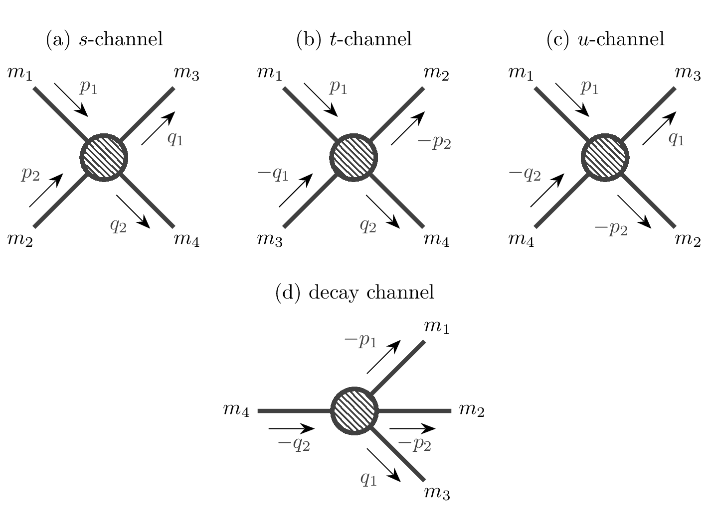
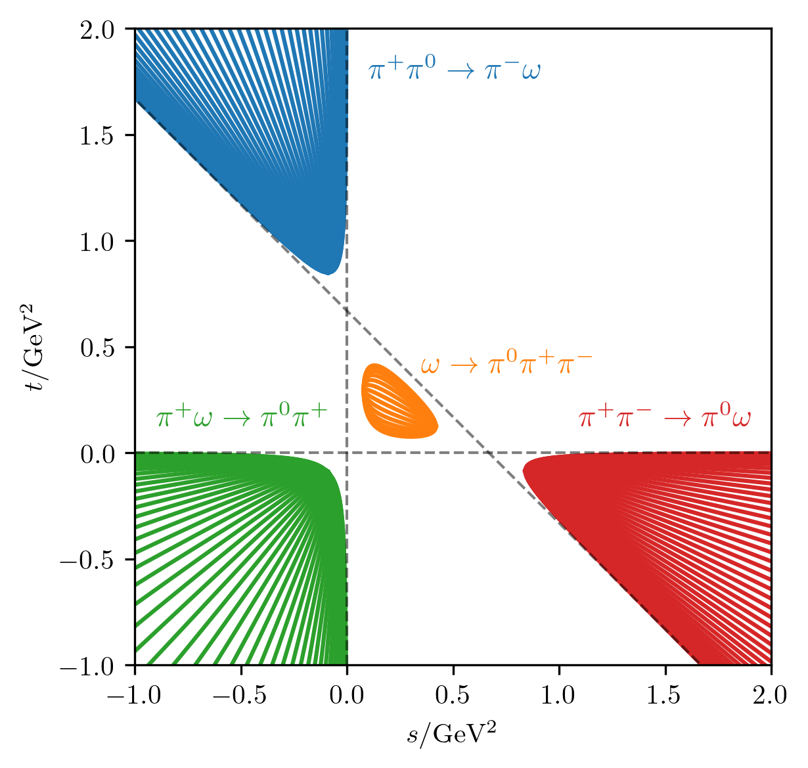

.. _kinematics-section:

Kinematics
==========

Four-momentum
-------------
Consider a particle with mass :math:`m`, energy :math:`E` and spatial momentum :math:`\vec{p}`. We define four-momentum

.. math::
    p = (E, \vec{p}) = (E, p_1, p_2, p_3) \, .

Real states satisfy the so-called mass-shell condition, given by

.. math::
    p^2 \equiv E^2 - \vec{p}^2 = m^2.

:math:`p^2` can be viewed as a scalar product :math:`(p\cdot p)` in Minkowski space, with a metric tensor

.. math::
    g = \mathrm{diag}(1, -1 , -1, -1) \, .

Switching to another inertial reference frame happens via a Lorentz transformation :math:`\Lambda` which has the property

.. math::
    g = \Lambda^T g \Lambda \, ,

i.e. it leaves the Minkowski scalar product invariant. Since physical observables should be independent of a reference frame, they only depend on scalar quantities.

Mandelstam variables
--------------------

.. _fig:four-particle-reactions:

    
    Four possible reactions with four particles with masses :math:`m_1, \dots, m_4`. Top row (a--c) shows scattering reactions in different configuration and the bottom row shows a decay.

As an example, consider a :math:`2\to2` process, with four external four-momenta: :math:`p_1, p_2, q_1, q_2`, as depicted on :numref:`fig:four-particle-reactions` (a). One can write down all possible scalar products between these momenta,

.. math::
    p_1^2, ~
	p_2^2, ~
	q_1^2, ~
	q_2^2, ~
	(p_1 \cdot p_2), ~
	(p_1 \cdot q_1), ~
	(p_1 \cdot q_2), ~
	(p_2 \cdot q_1), ~
	(p_2 \cdot q_2), ~
	(q_1 \cdot q_2) \, .

The first four are trivially fixed by the  corresponding mass-shell conditions. Energy-momentum conservation

.. math::
    p_1^\mu + p_2^\mu = q_1^\mu + q_2^\mu, \quad \text{for } \mu=0,1,2,3,

eliminates four more degrees of freedom and we are left with 2 independent variables. One customarily defines the Mandelstam variables

.. math::
    s &\equiv (p_1 + p_2)^2 = (q_1 + q_2)^2 \, , \\
	t &\equiv (p_1 - q_1)^2 = (p_2 - q_2)^2 \, , \\
	u &\equiv (p_1 - q_2)^2 = (p_2 - q_1)^2 \, ,

two of which are linearly independent and the third can be expressed by others using

.. math::
    s + t + u = \sum_{i=1}^{4} m_i^2 \equiv r \, .

We often exchange the variables :math:`t` and :math:`u` with the scattering angle :math:`\theta_s` via

.. math::
    \cos\theta_s = \frac{s(t-u) + (m_1^2 - m_2^2)(m_3^2 - m_4^2)}{\lambda^{1/2}(s, m_1^2, m_2^2)\lambda^{1/2}(s, m_3^2, m_4^2)} \, ,

where :math:`\lambda` denotes the Kallen function

.. math::
    \lambda(x, y, z) = x^2 + y^2 + z^2 - 2(xy + yz + zx) \, .

One can express :math:`t` and :math:`u` in terms of :math:`s` and :math:`\theta_s`,

.. math::
    t(s, \cos\theta_s) &= \frac{s\left(r - s\right) - (m_1^2 - m_2^2)(m_3^2 - m_4^2) + s\kappa(s)\cos\theta_s}{2s}  \, ,
	\\
	u(s, \cos\theta_s) &= \frac{s\left(r - s\right) + (m_1^2 - m_2^2)(m_3^2 - m_4^2) - s\kappa(s)\cos\theta_s}{2s}  \, .

where we used a common notation

.. math::
    \kappa(s) = \lambda^{1/2}(s, m_1^2, m_2^2)\lambda^{1/2}(s, m_3^2, m_4^2) / s \, .

Of course, :math:`\theta_s` is not a Lorentz-invariant quantity. It denotes the angle between :math:`\vec{p}_1` and :math:`\vec{q_1}` in the center of mass system (CMS). One can show that :math:`\sqrt{s} = E_{\mathrm{CMS}}`. Naturally,

.. math::
    E_{\mathrm{CMS}}^2 \geq \max(m_1^2 + m_2^2, m_3^2 + m_4^2) \equiv s_{\text{thr}},
	\quad
	\text{and}
	\quad
	-1 \leq \cos\theta_s \leq 1 \, .

These conditions can be used to arrive at the notion of *kinematic regions*. For :math:`s`-channel scattering, we have

.. math::
    s_{\text{thr}} \leq s < \infty, \qquad
	t(s,-1) \leq t \leq t(s,1), \qquad
	u(s,1) \leq u \leq u(s,-1).
    :label: eq:kinematic-region-s

.. _fig:kinematic_regions:

    
    Kinematic regions for the reaction :math:`\pi\pi\to\pi\omega` in :math:`s`- (red), :math:`t`- (blue), :math:`u`- (green), and decay (orange) channels. Coloured curves depict regions with constant :math:`\cos\theta_s`. Dashed grey lines correspond to the asymptotics :math:`s=0`, :math:`t=0`, and :math:`u=0`.

Consider crossed reactions of this process, depicted on :numref:`fig:four-particle-reactions` (b--c). We call these :math:`t`- and :math:`u`-channel processes, since they are obtained by substituting :math:`(s \leftrightarrow t)` and :math:`(s \leftrightarrow u)`, respectively. These substitutions also affect Eq. :eq:`eq:kinematic-region-s` and result into two additional kinematic regions, depicted on :numref:`fig:kinematic_regions`, together with the decay region, corresponding to :numref:`fig:four-particle-reactions` (d) (for details, see :cite:`Byckling:1971vca`). While these kinematic regions are disjoint and belong to different physical processes, they are related via crossing symmetry, which we will discuss in the following section.

Cross sections, decay rates, and the phase space
------------------------------------------------

When we talk about particle scattering, the relevant observable quantity is the *differential cross section* :math:`\text{d}\sigma`. Likewise, when we consider a decay, we concern ourselves with the *differential decay rate* :math:`\text{d}\Gamma`. Both of these quantities are defined per n-body phase space element of the outgoing state, given by

.. math::
    \text{d} \Phi_n(P; q_1, \dots, q_n) = \delta^{(4)}\left(P - \sum_{i=1}^{n} q_i \right) \prod_{i=1}^{n} \frac{\text{d}^3 q_i}{(2\pi)^3 2E_i} \, ,
    :label: eq:n-body-phase-space

where :math:`P` is the total four-momentum of the n-body system. In case of :math:`2\to n` scattering, the differential cross section is computed via

.. math::
    \text{d}\sigma(p_1, p_2 \rightarrow q_1, \dots, q_n)
	= \frac{(2\pi)^4 |\mathcal{M}|^2}{4\sqrt{(p_1 \cdot p_2)^2 - m_1^2 m_2^2}}
	\text{d} \Phi_n(p_1 + p_2; q_1, \dots, q_n) \, ,

while in case of :math:`1\to n` decay, the differential decay rate is defined as

.. math::
    \text{d}\Gamma(P \rightarrow q_1, \dots, q_n)
	= \frac{(2\pi)^4 |\mathcal{M}|^2}{2\sqrt{P^2}}
	\text{d} \Phi_n(P; q_1, \dots, q_n) \, .

In both cases, :math:`\mathcal{M}` is the *invariant amplitude* of the reaction, which encodes the dynamics of the system (and will be discussed in the upcoming sections).
In the simple case of two-body final state, one can exploit the Dirac delta function to integrate over four out of six kinematic variables and show that

.. math::
    \int (2\pi)^4 \text{d} \Phi_2(q; q_a, q_b) [\,\cdots]
	= \rho_{ab}(q^2) \int \frac{\text{d} \Omega}{2\pi} [\,\cdots] \, .
    :label: eq:two-body-phase-space-integral

We call

.. math::
    \rho_{ab}(q^2) \equiv \rho(q^2, q_a^2, q_b^2) = \frac{1}{16\pi} \frac{\lambda^{1/2}(q^2, q_a^2, q_b^2)}{s}

the *two-body phase space function*.
With this, we obtain the differential cross section and decay rate per solid angle :math:`\text{d}\Omega` of the final state,

.. math::
    \text{d}\sigma(p_1, p_2 \rightarrow q_1, q_2)
	&= \rho\left((p_1+p_2)^2, q_1^2, q_2^2\right)
	\frac{|\mathcal{M}|^2}{2\sqrt{(p_1 \cdot p_2)^2 - m_1^2 m_2^2}}
	\frac{\text{d}\Omega}{4\pi} \, , \\
	\text{d}\Gamma(P \rightarrow q_1, q_2)
	&= \rho\left(P^2, q_1^2, q_2^2\right)
	\frac{|\mathcal{M}|^2}{\sqrt{P^2}}
	\frac{\text{d}\Omega}{4\pi} \, .

Integrating over :math:`\text{d}\Omega` gives the *total cross section* :math:`\sigma` and the *decay width* :math:`\Gamma`,

.. math::
    \sigma(p_1, p_2 \rightarrow q_1, q_2)
	&= \rho\left((p_1+p_2)^2, q_1^2, q_2^2\right)
	\int
	\frac{|\mathcal{M}|^2}{2\sqrt{(p_1 \cdot p_2)^2 - m_1^2 m_2^2}}
	\frac{\text{d}\Omega}{4\pi} \, , \\
	\Gamma(P \rightarrow q_1, q_2)
	&= \rho\left(P^2, q_1^2, q_2^2\right)
	\int
	\frac{|\mathcal{M}|^2}{\sqrt{P^2}}
	\frac{\text{d}\Omega}{4\pi} \, .

